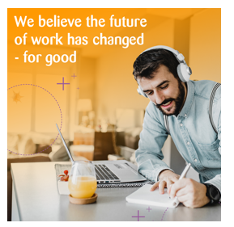

# HackZurich 2022 Challenge —  #9 Winter is coming — Are we ready?

> 🚧 We will publish the details of this challenge on Friday, 16. September during the workshop presentation.

 

## Short description

This winter, power shortages can be expected across Switzerland and will affect households and companies alike. How can innovation help us to use the energy smarter and avoid the risk of blackouts? We count on you!

 
 
 
 
 
 
 

> 👉 We are hiring! [Do work that matters – From ideation to implementation and beyond](https://www.zuehlke.com/en/careers)

|          |  |
:-------------------------:|:-------------------------:
 |   
